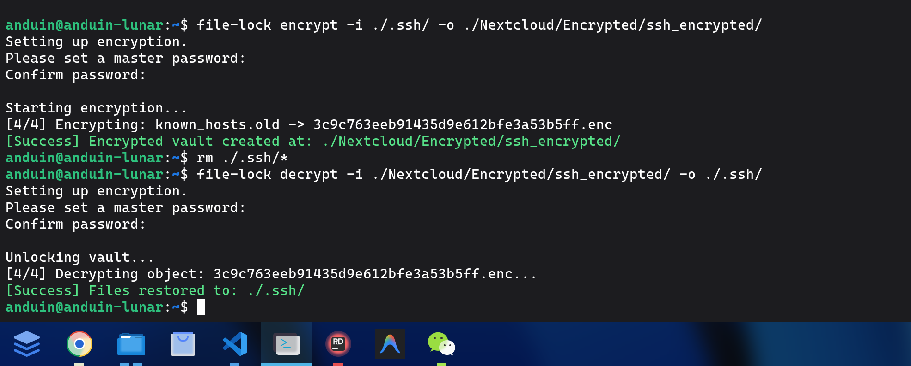

# Aiursoft.FileLock

[](https://gitlab.aiursoft.cn/aiursoft/file-lock/-/blob/master/LICENSE)
[](https://gitlab.aiursoft.cn/aiursoft/file-lock/-/pipelines)
[](https://gitlab.aiursoft.cn/aiursoft/file-lock/-/pipelines)
[](https://www.nuget.org/packages/Aiursoft.FileLock/)
[](https://gitlab.aiursoft.cn/aiursoft/file-lock/-/commits/master?ref_type=heads)

**Aiursoft.FileLock** is a Zero-Trust, command-line file encryption tool designed for secure storage and cloud archiving.

It converts your file structure into a flat, obfuscated vault where filenames, directory structures, and file contents are completely hidden from the storage provider.

## Why FileLock?

* **🛡️ Zero-Trust Architecture**: The server (or storage medium) sees nothing but random UUIDs. It cannot know what you stored, nor the original filenames or directory tree.
* **🔒 Industrial Strength Cryptography**:
    * **AES-256-GCM**: Authenticated encryption that prevents tampering.
    * **PBKDF2 (600,000 iterations)**: Protects your password against brute-force attacks.
    * **HKDF Key Derivation**: Each file uses a unique key derived from your master password and its unique salt.
* **🕵️ Metadata Obfuscation**: Original filenames and paths are encrypted inside the file payload. The physical files are renamed to meaningless `UUID.enc`.
* **🚀 Cross-Platform**: Runs anywhere .NET runs (Windows, Linux, macOS).

## Install

Requirements:

1. [.NET 10 SDK](http://dot.net/) or later.

Run the following command to install this tool globally:

```bash
dotnet tool install --global Aiursoft.FileLock
````

## Usage

Once installed, you can use the `file-lock` command in your terminal.



### 1 Encrypt a folder

Encrypt a local folder into a secure vault. You will be prompted to enter a password securely (input will be hidden).

```bash
file-lock encrypt -i ./my-secrets -o ./my-vault
```

**Options:**

* `-i, --input`: Source folder path to encrypt. (Required)
* `-o, --output`: Destination folder for the encrypted vault. (Required)
* `-p, --password`: (Optional) Provide password directly. If not set, interactive mode is used.

**What happens?**
Your `my-secrets` folder structure will be flattened into `my-vault`. Inside `my-vault`, you will see only files like `a3f1...9b2.enc` and a `vault.config`. No one can tell if it's a video, a document, or a picture.

### 2 Decrypt a vault

Restore your files from the vault to a readable folder.

```bash
file-lock decrypt -i ./my-vault -o ./restored-files
```

**Options:**

* `-i, --input`: Encrypted vault path. (Required)
* `-o, --output`: Destination folder for restored files. (Required)
* `-p, --password`: (Optional) Provide password directly.

**What happens?**
FileLock reads the encrypted metadata, reconstructs your original directory tree (e.g., `photos/2023/party.jpg`), and restores the file contents.

## Security Design

We take security seriously. Here is the cryptographic stack used in FileLock:

1.  **Vault Initialization**: A random 32-byte `VaultSalt` is generated when a vault is created.
2.  **Master Key Derivation**: `PBKDF2-HMAC-SHA256` is used with **600,000 iterations** to derive a Master Key from your password and the Vault Salt.
3.  **Per-File Key**: For every single file, a unique `FileUUID` is generated. We use `HKDF` to derive a unique `FileKey` from the Master Key and the FileUUID.
4.  **Encryption**: The file content AND the original file path are packed together and encrypted using `AES-256-GCM`.
    * This ensures that even if two files have identical content, their encrypted output will be completely different.
    * GCM mode ensures data integrity; any modification to the encrypted file will cause decryption to fail immediately.

## Contributing

There are many ways to contribute to the project: logging bugs, submitting pull requests, reporting issues, and creating suggestions.

## License

[MIT](https://www.google.com/search?q=LICENSE)

